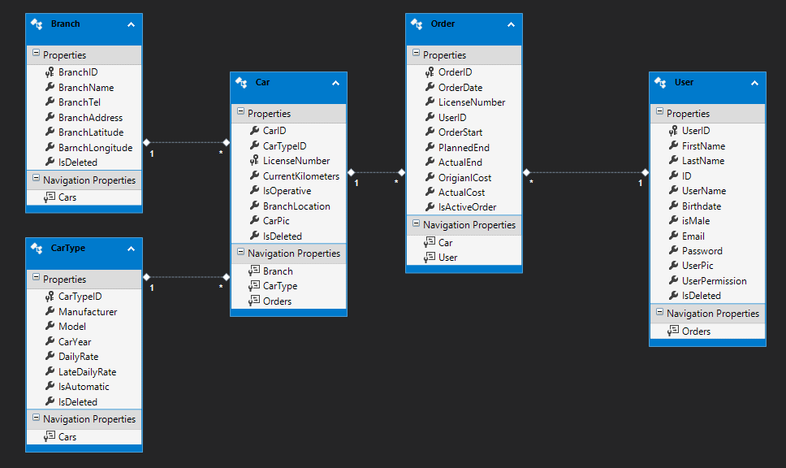

# Car Rental Company Project

## Data Base
**Technologies, Infrastructure and providers for this project**
* MS SQL Server
* C# (Server Side) with WebAPI
* Angular (Client Side)
* Bootstrap 3, 4
* Custom Pipes
* Interceptor
* Angular material

## Server side
* The server is build according to the N-tier model.

***
## DB
** DB  Diagram**
Attached a DB diagram 
**More info can be found in XXX.doc** 
 
***
### DAL
* The DAL holds the DB Entity framework.

### BOL
**The BOL Contains six classes:** 
1. BranchModel.
2. CarTypeModel.
3. CarModel.
4. UserModel.
5. OrderModel.
6. IdValidations.

### BLL
Contains C.R.U.D operations.
BLL holds operations manages for Models (in the BOL):
1. BranchManager.
2. CarTypeManager.
3. CarManager.
4. UserManager.
5. OrderManager.

### UIL
API that receives client requests and performs them with the relevant BLL Managers, if user's authorization and authentication requirements are met.
 
***
## Client side
* Client side was written in Angular.
* Client uses services to communicate with the server.
 

***
## Installation
**1. DB creation**

1. Files for creating the DB located in the "DB Creation" folder : https://github.com/oriTid/CS_Search_project/FINAL/tree/master/DB%20Creat
2. You have 2 options for creating the DB:
* Restore CS_Search_DB.bak
* Execute Script CS_Search_DB.sql on SQL Server 
***

**2. Data Connection setup  in the server**

After DB is created, you will need to update the Data-Connection, in order for the program to work properly:

**The connection is set in the Web.Config file located in the 04_UIL:**
1. Update *data source* with your SQL server name  : data source=YOUR SQL SERVER NAME
2. Update **catalog** with the DB name **(if you changed it)** initial catalog=CarRentComp (or you DB name if you change it)

**Dont forget to update connection string before running the server.**
***

**3. Angular Environment setup**

First thing first - **Don’t forget NPM Install**

After the **server** is up and running  you can see the port used for communicating.

1. Navigate to **"environment.ts"** , located in src folder.
2. Update the **endpoint parameter** with your local server port
etc – 'http:/localhost:**XXX**'
